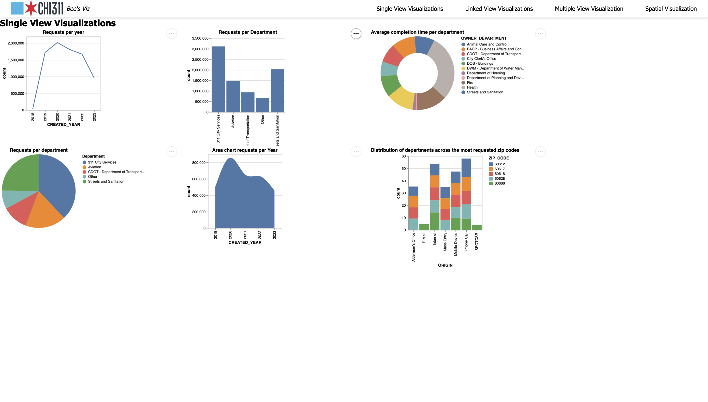
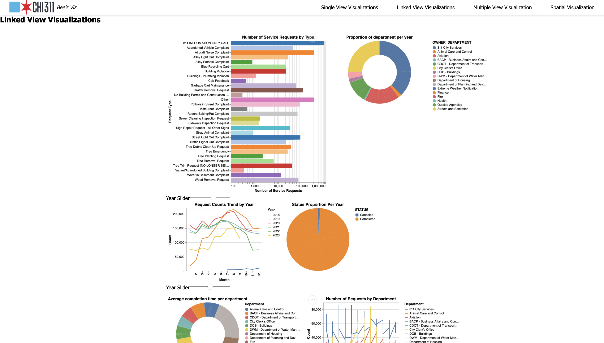
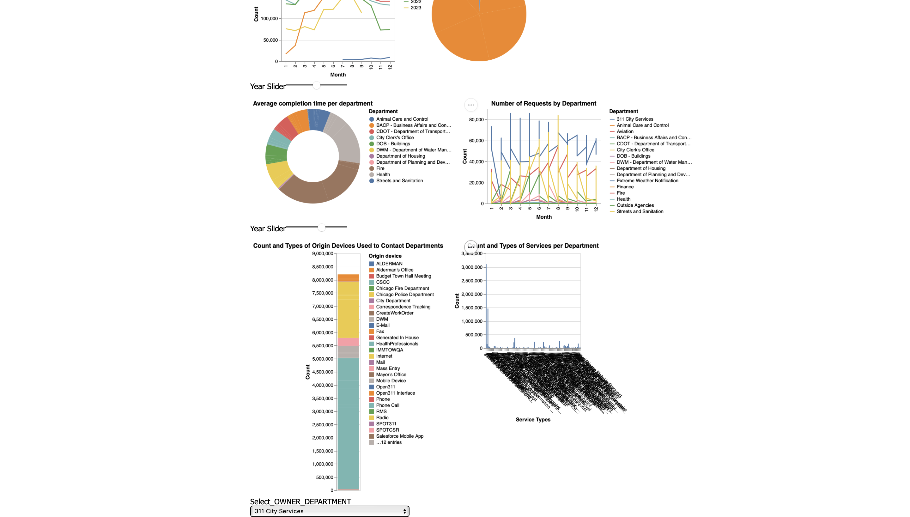
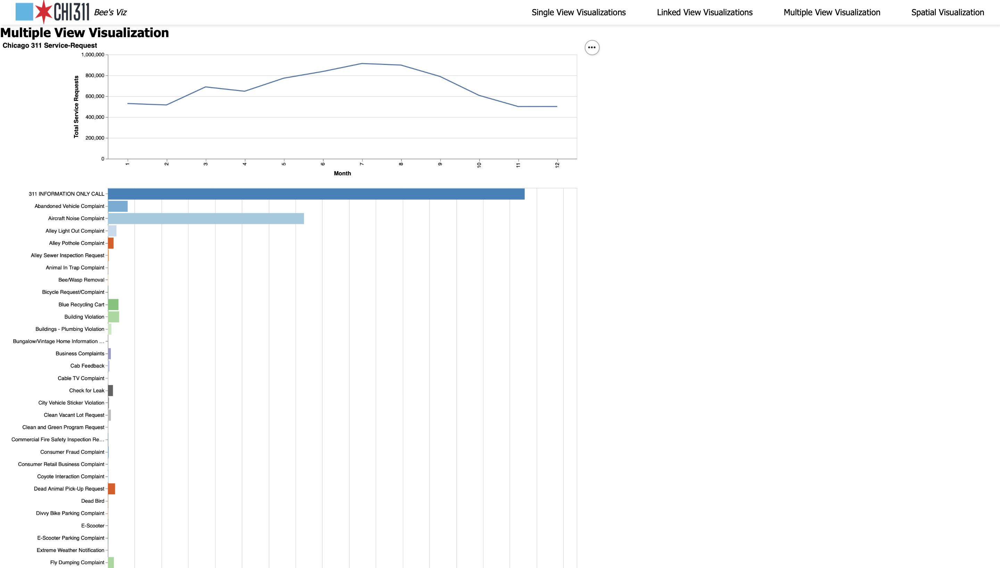
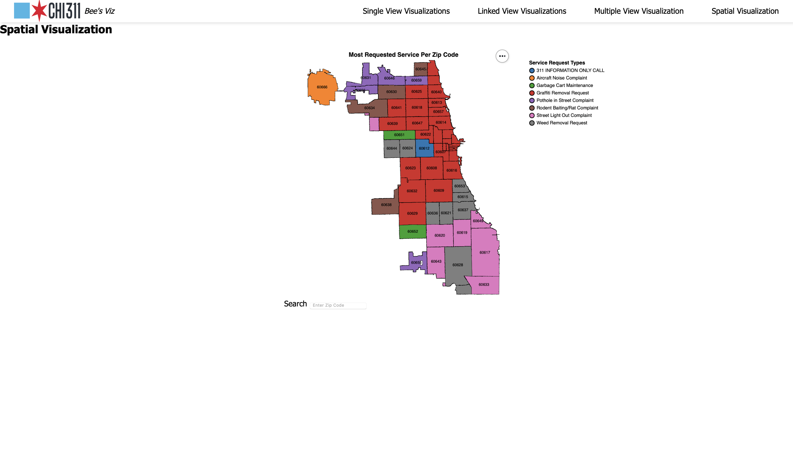

_## Description of the Dataset:
The dataset containing 311 Service Requests received by the City of Chicago is a repository of citizen-reported incidents and service requests within the city of Chicago. This database contains a large volume of records spanning many years. It's made up 8.66 million rows and 39 columns. Each row represents a service request, while the columns contain attributes related to the service call.

The data is collected through the 311 system, where residents can report non-emergency issues and request city services. The 311 system provides an important channel for citizens to communicate their concerns and issues to the city with transparency and accountability. Potential users of the 311 Service Request dataset may include city officials, urban planners, and researchers seeking to analyze patterns and trends in service requests, resource allocation, or decision-making by city agencies. Additionally, it can be a valuable resource for citizens interested in assessing the quality of services and promoting civic engagement in Chicago.

## Key Insights from a Summarized Analysis of the 311 Service Requests Data:
The Chicago 311 service request dataset covers a broad spectrum of civic issues, detailing various request types, involved departments, current statuses, and location details. As we navigate through the data, certain request types stand out more, prompting additional investigation into less common anomalies. These are some of the most important points we found while exploring our dataset

Examining request statuses reveals interesting trends (particularly a significant number of closed requests)indicating an effective resolution process. 
Time-based analysis unveils patterns across months, days, and hours, offering insights into when specific requests peak for example drops in request during covid or how tree trim requests drastically drop during the winter. 
Geospatial examination identifies clusters of service requests, providing valuable information for targeted interventions.

The dataset also sheds light on departmental involvement, highlighting those associated with a higher volume of requests and offering insights into the administrative landscape.

Exploring correlations between variables, such as request type and closure time, Request Type and Area, Area and Origin, enhances our understanding of area attributes and adds additional layers of information. 

Overall, ensuring data quality is crucial, with attention given to addressing identified issues. This foundational analysis provides valuable insights into Chicago's civic landscape, laying the groundwork for informed decision-making and potential service delivery improvements.

## Important Questions:
As we worked with our data, some interesting questions popped up, pointing us toward areas worth exploring further.
Some of these questions where the following...

### <u><b>Is geographic data correlated with the amount of 311 requests?</u></b>
**-Identifying high-demand areas:**
If certain locations consistently have a high number of requests, this could indicate areas where city services are in high demand.
**-Resource allocation:**
Understanding the correlation between location and number of requests can help city officials allocate resources more effectively.
**-Improving city services:**
If certain types of requests are more common in specific areas, this could highlight opportunities to improve city 
services.
**-Community engagement:**
Locations with a high number of requests might indicate areas where residents are more engaged with the 311 system.

### <u><b>How does the number of requests vary across different timeframes?</u></b>
**-Peak hours:**
Identifying peak hours for 311 requests can help in allocating resources efficiently. For example, if most requests are made during business hours, the city might need to allocate more staff during this time.
**-Service availability:**
If there are a significant number of requests outside of normal business hours, it might indicate a need for extended service hours or 24/7 availability.
**-Emergency services:**
Understanding when urgent requests are typically made can help emergency services prepare and respond more effectively.

### <u><b>Can we infer any correlation between the geographic data and the rest of the attributes?</u></b>
**-Resource allocation:**
If certain types of requests are more common in specific areas, resources can be allocated more efficiently to handle
these requests.
**-Policy making:**
Understanding the geographic distribution of service requests can help policymakers identify areas that may require
additional attention or resources.
**-Trend analysis:**
Over time, analyzing the correlation between location and service requests can reveal trends that might be indicative of
larger issues. For example, a sudden increase in a specific type of service request in a particular area could indicate
a new problem that needs to be addressed.
**-Community engagement:**
This analysis can also help in understanding the engagement level of different communities. If some areas have a higher
number of service requests, it could mean that residents are more engaged with the 311 services.

## Website Overview:
[This is an external link to our website](https://tle87.github.io/)

The home page of our website is where the user can make the decision to which type of visualization he would like ot see first. We did this because it allows for a clean and professional aesthetic instead of the user being bombarded with visual upon loading.
## <u><b>Data Transformations and Encodings:</u></b>
**Single View Visualizations**

For our Single View Visualizations, we used columns such as CREATED_DATE, SR_TYPE, STATUS, and ORIGIN. We turned these details into JSON files for our JS (JavaScript) file. With these visualizations, we can dislay important data like when service requests were made (CREATED_DATE), the types of requests (SR_TYPE), what's the status of requests (STATUS), and where they came from (ORIGIN) and use them to make visualtions such as a line graph displaying request per year. These typea of visualiztions allow everyone to see and understand the patterns, trends, and quantity in the 311 service request data.

**Linked View Visualizations**

For our Linked View Visualizations, we continued to leverage the insights from columns such as CREATED_DATE, SR_TYPE, STATUS, and ORIGIN. However, we took it a step further by adding functionality to enhance user interaction. For instance, we introduced a year slider, enabling users to choose the specific year they want to observe data from. This dynamic feature enhances the user experience, allowing for more focused and customizable insights. Additionally, we implemented linked visuals to establish connections between different aspects of the data. This interactivity allows users to explore correlations and patterns across various dimensions. For example, a user could select a specific service type in one visual, and the linked views would update to provide context-specific information, creating a more comprehensive understanding of the dataset.
These linked view visualizations aim to provide a more interactive view of the 311 service request data, empowering users to choose their analysis and gain deeper insights into the relationships and dynamics present in the dataset.

**Multiple View Visualizations**

For our Multiple View Visualizations, we took a deeper dive into understanding the relationship between the type of service request and the time of the year. In this exploration, we created a dynamic multiple view visualization that brings these aspects together. We added a click and drag feature on the line plot, providing an interactive experience to observe how service requests aggregate across different service types over time.

**Spatial Visualizations**

Our Spatial Visualization is an interactive thematic map of the most requested 311 service per zip code in Chicago. Each zip code area is color-coded by its most requested service. The legend that states the service each color corresponds to is provided on the right. Most zip code areas on the map are labeled by its zip code number. However, some zip code areas are too small to label, such as 60602. The tooltip feature was added to help viewers check the zip code of an area by hovering over it. Included in the tooltip description is the most requested service to help viewers figure out what is the most requested service in an area without only relying on the variations of color. A search filter is also added below the map to help viewers find and focus on particular zip code areas. When the viewer enters a zip code, such as "60608", the opacity of all other zip code areas will significantly decrease in order to highlight the given zip code. The viewer can provide multiple zip code areas by adding a "|" in between each zip code, conforming to the regular expression standards.

## Findings
In conclusion, the completion of 311 service request and recording the associated data is very important for the city’s well being. It not only directly improves the quality of life of the citizens of chicago by addressing everyday issues and fostering a sense of trust and satisfaction among residents, but also plays a crucial role in ensuring safety and health by promptly resolving urgent concerns. Additionally, the data related to these request informs city officials on resource allocation, aids in long-term planning, and enables a data-driven approach to governance. This ensures that resources are allocated effectively and fairly. The practice also promotes transparency and accountability, allowing citizens to track progress and hold officials responsible. Overall, these 311 Service request directly impact the quality of life in Chicago and this is why it makes this data so crucial for chicagoans.
